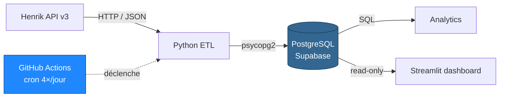
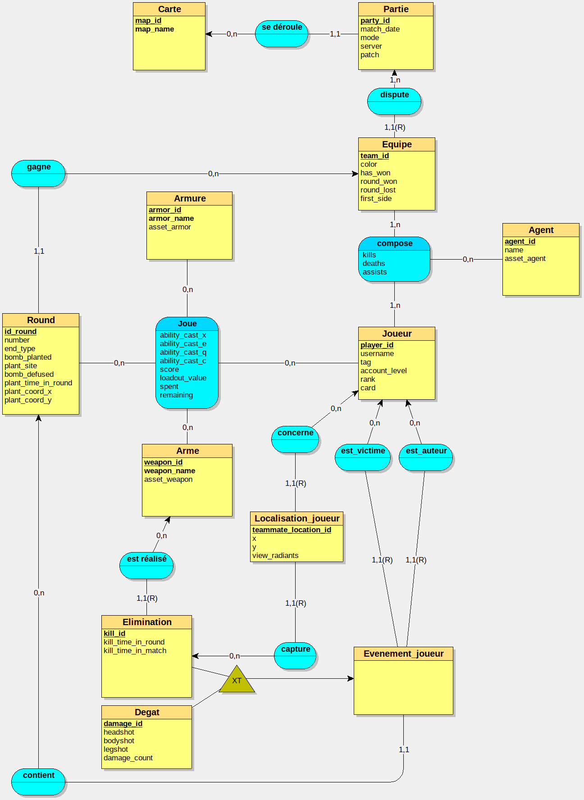

<div align="center">

# val-analytics-pipeline

**Pipeline de données end-to-end pour analyser mes matchs Valorant compétitifs**

Ingestion automatisée via l'API Henrik → stockage relationnel sur PostgreSQL → analyse SQL & dashboard Streamlit.

[](https://www.python.org/)
[](https://supabase.com/)
[](https://github.com/features/actions)
[]()

</div>

---

## 📖 Aperçu

**val-analytics-pipeline** est un projet personnel qui couvre l'ensemble du cycle de vie d'une donnée : collecte via API, transformation, persistance en base relationnelle, exposition pour analyse, et restitution visuelle.

Concrètement, le pipeline récupère mes 5 derniers matchs Valorant via l'[API Henrik](https://docs.henrikdev.xyz/) et les insère dans une base PostgreSQL hébergée sur Supabase. Seules les **parties compétitives** sont conservées. L'exécution est automatisée via GitHub Actions et tourne plusieurs fois par jour.



---

## ✨ Caractéristiques

- 🔄 **Ingestion automatisée** : 4 exécutions quotidiennes via GitHub Actions + déclenchement manuel
- 🛡️ **Transactionnel** : rollback global en cas d'erreur, commit unique en fin de traitement, garantit l'intégrité référentielle
- 🎯 **Filtrage métier** : seules les parties classées (compétitives) sont insérées
- 🗄️ **Schéma relationnel riche** : 14 tables, héritage relationnel pour les événements en jeu, clés naturelles basées sur les identifiants Riot
- ⚡ **Performance** : caches module-level pour les tables de référence (cartes, agents, armes), chargés une seule fois au démarrage
- 📝 **Logs structurés** : double handler (fichier détaillé + console colorée filtrée), traçabilité complète des exécutions
- 🔐 **Secrets isolés** : aucune donnée sensible dans le code, tout passe par variables d'environnement et GitHub Secrets en production

---

## 🛠️ Stack technique

| Couche | Technologie |
|---|---|
| Langage | Python 3.13 |
| Base de données | PostgreSQL 15 (hébergée sur [Supabase](https://supabase.com/), région West EU) |
| Source de données | [Henrik API v3](https://docs.henrikdev.xyz/) (non officielle, gratuite) |
| Driver DB | `psycopg2-binary` |
| HTTP | `requests` |
| Configuration | `python-dotenv` |
| Orchestration | GitHub Actions (cron + `workflow_dispatch`) |
| Dashboard *(à venir)* | Streamlit, déployé sur Streamlit Community Cloud |

---

## 🗂️ Structure du projet

```
val-analytics-pipeline/
├── .github/
│   └── workflows/
│       └── cron.yml              # Orchestration GitHub Actions
├── ingestion/
│   ├── data/                     # Exports JSON bruts (debug)
│   ├── docs/                     # MCD, MLD, schémas
│   ├── logs/
│   │   └── pipeline.log          # Logs d'exécution (rotation à venir)
│   ├── sql/                      # DDL et scripts d'initialisation
│   └── src/
│       ├── api_client.py         # Wrappers API Henrik
│       ├── config.py             # Chargement des variables d'env
│       ├── insert_db.py          # Fonctions d'insertion (toutes tables)
│       ├── logger.py             # Configuration logging (couleur, filtres)
│       └── main.py               # Point d'entrée
├── analytics/                    # 🚧 Requêtes SQL d'analyse (à venir)
├── dashboard/                    # 🚧 Application Streamlit (à venir)
├── .env                          # Variables d'environnement (non versionné)
├── .gitignore
├── requirements.txt
└── README.md
```

---

## 🗄️ Modèle de données

La base s'articule autour de **14 tables** regroupées en quatre familles fonctionnelles.

<p align="center">
  
</p>

| Famille | Tables |
|---|---|
| **Référentiels** | `carte`, `agent`, `arme`, `armure` |
| **Partie** | `partie`, `equipe`, `round`, `compose` |
| **Joueur** | `joueur`, `joue` |
| **Événements** | `evenement_joueur`, `elimination`, `degat`, `localisation_joueur` |

### Choix de modélisation notables

- **Clé naturelle** — Le `PUUID` Riot (UUID stable fourni par l'API) sert directement de clé primaire pour `joueur` et de clé étrangère partout. Pas de génération d'ID artificiel pour les joueurs.

- **Héritage relationnel** — La table `evenement_joueur` est mère de `elimination` et `degat`. Un même `id_event_player` peut donc avoir une ligne dans chacune des deux filles, ce qui permet de représenter qu'un même événement génère à la fois un kill et un récap de dégâts.

- **Tracking spatial** — `localisation_joueur` stocke la position `(x, y, view_radiant)` des 10 joueurs au moment de chaque élimination, victime et auteur compris. Cette table alimente les futures heatmaps du dashboard.

- **UUID sentinelles** — Pour gérer les FK non-nullables quand la donnée est absente : `00000000-...-000000000000` pour l'armure absente, `00000000-...-000000000001` pour l'arme absente.

- **Convention de nommage** — Tables et colonnes en minuscules (convention PostgreSQL / Supabase), évite le besoin de guillemets dans les requêtes.

> 📄 Le DDL complet est disponible dans [`ingestion/sql/ddl.sql`](ingestion/sql/ddl.sql). Le MCD est dans [`ingestion/docs/`](ingestion/docs/) (fichiers `mcd_ver*.png`).

---

## 🚀 Démarrage rapide

### Prérequis

- Python **3.13+**
- Une base PostgreSQL accessible (locale, Supabase, ou autre)
- Une clé API Henrik *(gratuite — voir [`docs.henrikdev.xyz`](https://docs.henrikdev.xyz/))*
- Un compte Riot avec quelques matchs compétitifs

### Installation

```bash
# 1. Cloner le repo
git clone https://github.com/dylan-manseri/val-analytics-pipeline.git
cd val-analytics-pipeline

# 2. Créer un environnement virtuel
python -m venv .venv
source .venv/bin/activate          # macOS / Linux
# .venv\Scripts\activate           # Windows

# 3. Installer les dépendances
pip install -r requirements.txt

# 4. Initialiser le schéma de la base
psql "$DATABASE_URL" -f ingestion/sql/ddl.sql
```

### Configuration

Copiez `.env.example` en `.env` à la racine du projet :

```dotenv
# API Henrik
HENRIK_API_KEY=hdev-xxxxxxxx-xxxx-xxxx-xxxx-xxxxxxxxxxxx

# Base de données PostgreSQL
DB_HOST=db.xxxxxxxxxxxxx.supabase.co
DB_PORT=5432
DB_NAME=postgres
DB_USER=postgres
DB_PASSWORD=your_password
DB_SSLMODE=require

# Joueur cible
RIOT_USERNAME=your_username
RIOT_TAG=tag
```

### Lancer le pipeline

```bash
python ingestion/src/main.py
```

Une exécution réussie produit en sortie un résumé des insertions et écrit le détail dans `ingestion/logs/pipeline.log`.

---

## ⚙️ Automatisation

Le pipeline tourne en production via **GitHub Actions**.

| Aspect | Configuration |
|---|---|
| Fréquence | 4 exécutions par jour — 08h, 14h, 20h, 00h (heure France) |
| Déclenchement manuel | `workflow_dispatch` activé sur la branche `main` |
| Runtime | Python 3.13 sur `ubuntu-latest` |
| Actions utilisées | `actions/checkout@v4`, `actions/setup-python@v5` |
| Secrets | Stockés dans GitHub Secrets — jamais en clair dans le repo |

Le workflow est défini dans [`.github/workflows/cron.yml`](.github/workflows/cron.yml).

---

## 🗺️ Roadmap

### ✅ Phase 1 — Trouver l'API
- [x] Tentative avec l'API Riot officielle (réservée aux partenaires) → abandon
- [x] Découverte de l'API Henrik → choix retenu (gratuite, non officielle)
- [x] Lecture de la documentation Henrik

### ✅ Phase 2 — Fetch l'API
- [x] Récupération du PUUID d'un joueur à partir de son nom et tag
- [x] Récupération des 5 derniers matchs via le PUUID
- [x] Stockage des données brutes dans un fichier `matches.json`

### ✅ Phase 3 — Schéma MCD
- [x] Analyse de la structure JSON de l'API, sélection des données pertinentes
- [x] Modélisation des entités et relations (matches, players, match_players, kill_events)
- [x] Création du MCD *(cf. `ingestion/docs/mcd_ver*.png`)*

### ✅ Phase 4 — Script SQL
- [x] Définition de l'ordre de création des tables et des clés étrangères
- [x] Définition du DDL
- [x] Exécution du DDL sur la base de données

### ✅ Phase 5 — Pipeline d'insertion Python
- [x] Étude de faisabilité avec les librairies existantes
- [x] Fonctions d'insertion des tables à faible dépendance (Carte, Partie, Équipe)
- [x] Fonctions d'insertion des tables à forte dépendance

### ✅ Phase 6 — Tests
- [x] Vérifier l'intégrité des données insérées
- [x] Tester avec plusieurs matchs

### ✅ Phase 7 — Déploiement
- [x] Hébergement sur Supabase (PostgreSQL, région West EU)
- [x] Cron via GitHub Actions (4×/jour + run manuel)
- [x] Gestion des secrets via GitHub Secrets

### 🚧 Phase 8 — Requêtes SQL d'analyse *(en cours)*
- [ ] Définir les métriques à analyser (KDA, win rate, headshot %, taux d'utilisation des agents et armes)
- [ ] Écrire les requêtes SQL correspondantes
- [ ] Génération de heatmaps de positions à partir de `localisation_joueur`

### 🚧 Phase 9 — Analyse avec pandas
- [ ] Notebooks d'exploration sur les données extraites
- [ ] Statistiques inter-matchs (tendances, corrélations)

### 🚧 Phase 10 — Tableau de bord
- [ ] App Streamlit avec affichage des cartes joueur et icônes (agents, armes, maps)
- [ ] Filtres interactifs (par carte, par période, par agent)
- [ ] Déploiement sur Streamlit Community Cloud

---

## ⚠️ Limites connues

- **Liaison `round` ↔ `equipe`** — Un round n'est rattaché à son équipe gagnante que via `winning_team_id`. Il n'existe pas de FK directe entre un round et la `partie` ou les équipes participantes. La donnée reste récupérable (chaque round a forcément une équipe gagnante, elle-même rattachée à sa `partie`), mais cela impose un join supplémentaire dans les requêtes d'analyse.

- **Profondeur d'historique** — L'API Henrik renvoie uniquement les 5 derniers matchs par requête. L'historique se construit donc progressivement, au fil des exécutions du cron.

- **Dépendance à une API non officielle** — L'API Henrik n'est pas opérée par Riot Games. Une indisponibilité ou un changement de politique côté Henrik affecterait directement le pipeline.

---

## 👤 Contact

**Dylan Manseri** — Étudiant en L3 Informatique, en recherche de stage Data Engineering.

[](https://github.com/dylan-manseri)
[](https://www.linkedin.com/in/dylan-manseri-281131382/)
[](mailto:manseri.dylan1@gmail.com)

---

<div align="center">
<sub>Projet personnel · Données issues de mes propres matchs · Non affilié à Riot Games</sub>
</div>